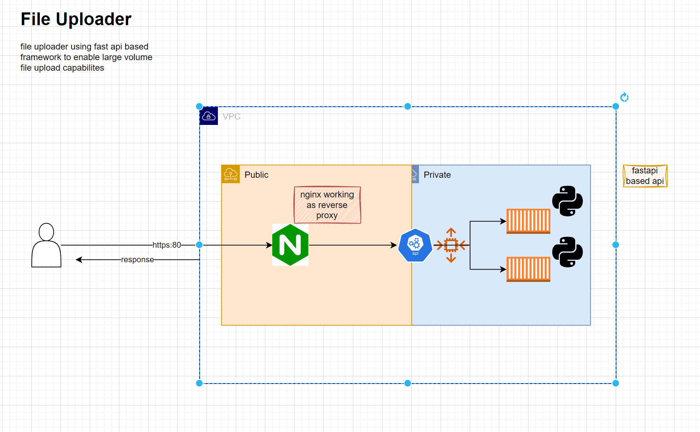

# Large file uploader

## Introduction
Welcome to my project for large file uploader.
API gateway and all the api gateway have limitation on file upload upto 10MB

## Features
- allows large file upload on api ( upto 100 MB)
- nginx as reverse proxy
- allows all types of files
- Super easy to implement

## Installation
To install this project, follow these steps:
1. Clone the repository.
2. Install dependencies.
3. Run the project.

## Screenshots

## Styling

  <h3 style="color: #333;">Custom Section</h3>
  
This is a custom section with some styling.

## Contributing
Feel free to contribute to this project by following our [contribution guidelines](CONTRIBUTING.md).

## License
This project is licensed under the [MIT License](LICENSE).
